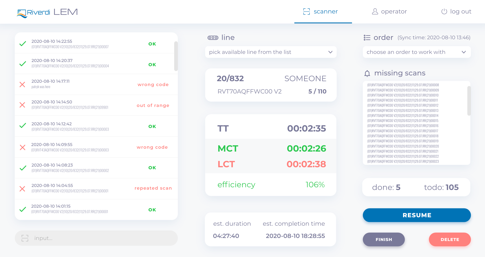
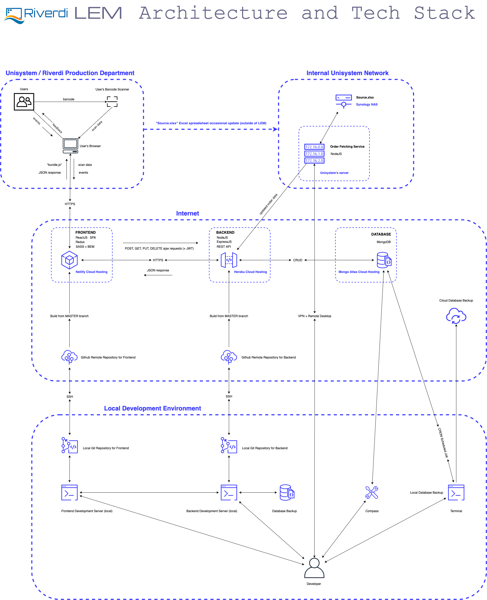
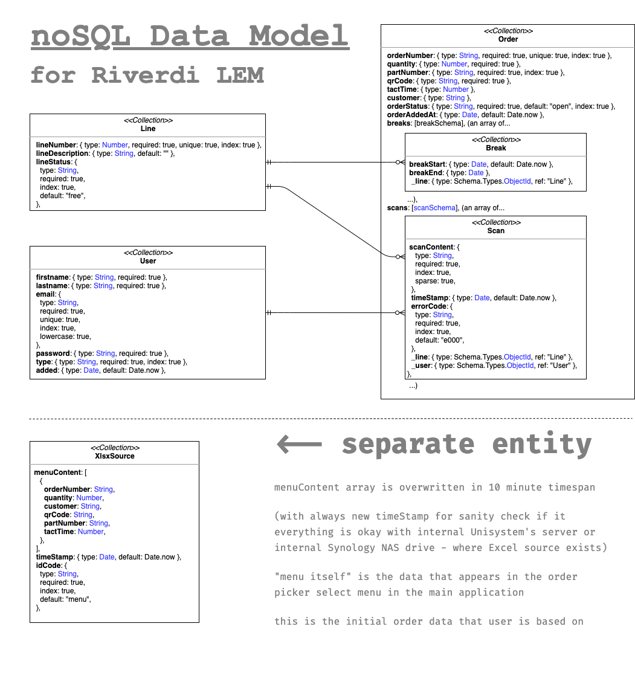

# LEM (Line Efficiency Monitoring) System

Hello, CS50 👋

> _"...the nature of your project is entirely up to you. You may implement your project in any language(s)._
>
> _you are welcome to utilize infrastructure other than the CS50 IDE. All that we ask is that you build something of interest to you,_
>
> _that you solve an actual problem,_
>
> _that you impact your community, or that you change the world..."_
>
> **- CS50x's final project suggestions**

Taking into consideration the requirements above I have created a **web-based application** for my colleagues from manufacturing department at of [Unisystem](https://www.unisystem-displays.com/en/) and [Riverdi](https://riverdi.com/) (Industrial display and touch screen manufacturer).

I have called it **Riverdi LEM** (Line Efficiency Monitoring).

  

The application has to solve some issues that my folks have to tackle on daily basis;

_For example – sometimes they can find hard to estimate if they have correct manufacturing speed to meet the deadline. (especially when they are manufacturing new or customized product), they use standard timers and excel spreadsheet (or calculator) to do estimations_

[**LEM System**](https://riverdi-lem.netlify.app/) is an internal tool for measuring and monitoring manufacturing/production lines.

The project was created as the [final project](https://cs50.harvard.edu/x/2020/project/) to graduate [Harvard&#39;s CS50](https://cs50.harvard.edu/x/2020/) for benefit of my colleagues at Manufacturing Department of [Unisystem](https://www.unisystem-displays.com/en/) and [Riverdi](https://riverdi.com/) (Industrial display and touch screen manufacturer).

## The main features of LEM System:

**The software has to:**

1. Utilize bar-code scanners (in fact, it is not a bar code but [Data Matrix](https://en.wikipedia.org/wiki/Data_Matrix) – it&#39;s 2D code, somewhat similar to QR Code) that the company bought for scanning newly developed stickers that are placed on ready made products (as input data)
2. Read MS Excel file with production schedule and part number details and retrieve data about tact times, part numbers and orders to work with.
3. Give an instant feedback about MCT LCT efficiency, estimated duration of the order and estimated time of order completion. (also with colors - GREEN and RED so people can instantly see if they are winning or losing)
4. Give an information about Order, customer, manufactured piece (part number), ordered quantity
5. Give an information about missing pieces
6. Give an information of mixed up pieces (for example the same part number but form another order from same or another client
7. Give feedback about counting one piece more than once
8. Give information about how many pieces (of current order) was done on current line and on all the lines and how many pieces are to do
9. Give ability to have brakes during completion the given order
10. Give ability to work on more than one line
11. Give ability to start an order on one line and finish it on another
12. Give ability work on more than one order simultaneously
13. Give ability to work on the same (big) order on more than one line at the same time
14. Handle users (production workers, service, foremen and managers) accounts (with authorization and authentication)
15. When user reserves a line, the line has to be unavailable to another user until it is released

**Future:**

1. Manager dashboard with:
2. Statistics: orders, users, lines, errors, times, partnumbers
3. User account management
4. Line management
5. Order and work scheduling (← that one, can be implemented only when the application will be independent form this huge excel spreadsheet that is currently a bread and butter of all department and everything is based on it)

## Intranet or Internet?

I was wondering where the application should be placed (as an **internal tool** – it could live on Unisystem&#39;s internal servers without outside access, BUT…

1. Unisystem&#39;s server is overloaded by other things - Unisystem&#39;s network is under heavy load (because of COVID19, and remote desktop work)
2. Unisystem&#39;s server uptime is also not a 100%
3. Sometimes external access to the app could be beneficial (for example if a manager wants to have access for some statistics or reports for presentational or meeting purposes.

So I figured out that external server (with authentication and authorization) will be better and more empowering and flexible option.

## What about tech stack?

I&#39;ve almost picked Python with Flask and MySQL (I had it fresh in my mind after CS50 Finance App), but I have chosen all JavaScript stack – MERN (MongoDB, ExpressJS, ReactJS, NodeJS). Mostly because these days this stack gives me more and cheaper (even free) deployment options. It&#39;s also very flexible.

To have MERN stack somewhat down I took some Udemy Courses from, always excellent, Stephen Grider. And I&#39;ve read, a lot. (And coded some side projects).

So, from CS50... JavaScript – yes, but…

1. JavaScript (NodeJS) instead of Python on the server
2. ExpressJS instead of Flask for API development
3. MongoDB instead of MySQL/SQLite as it is better suited for JavaScript and the project itself does not have some complicated relations.
4. SPA (Single Page App) instead of classic Server Side Rendering.
5. Client – Server architecture instead of monolith server

And since I&#39;m building an interactive dashboard with lots of pieces of state floating around so I figured It will be reasonable to use some well-established JavaScript framework (React) with some state management system (Redux)

So the application structure would be:

- [**CLIENT**](https://github.com/thembones79/lem-client#readme) – Javascript Single Page Application in React - [deployed on Netlify](https://riverdi-lem.netlify.app/)
- [**SERVER**](https://github.com/thembones79/lem-server#readme) – RESTful API in ExpressJS - [deployed on Heroku](https://riverdi-lem.herokuapp.com/) (SHOULD screem `"Unauthorized"`)
- **DATABASE** – MongoDB (deployed on Mongo Atlas)

and…

- **Service** (deployed on Unisystem&#39;s internal server) in NodeJS for synchronizing Riverdi&#39;s internal Excel spreadsheet **new order input data** to backend REST API (one way only) on Heroku.

Also…

- Remote **Github** repositories (separate for the client and the server for **automatic code deployment** from commits (Git flow, with lots of branching, pushing, merging, pulling)
- For managing my work I&#39;ve used **Trello** kanban board
- For [**wireframing**](https://xd.adobe.com/view/63aa12c9-36fe-4d67-a34a-670e314ef771-36f9/grid) and [**layouts**](https://xd.adobe.com/view/e7eef714-c7ad-4872-819a-0de046fcd278-b2bd/grid) I&#39;ve used **Adobe XD**
- Sketches for wireframing I&#39;ve done in **Exalidraw**

### Drawing of the architecture

  

### Data Model

  

### JWT

For authentication I have used JSON Web Tokens (saved in the browser&#39;s local storage) instead of cookies and sessions.

Why? A far as I know my colleagues – there are will be new requirements and my app will grow. JWT will give me flexibility to, for example, spin off a mobile app and easily connect it to my REST API.

### For security concerns, I have:

1. passwords stored in database in **encrypted form** (hashed and salted by **Bcrypt**)
2. **HTTPS** communication enforced on everything
3. **Helmet** installed and configuted on Node Express API
4. **security headers** configured for frontend on netlify
5. made sure that all the secrets and api keys were not added to git repositories
6. MongoDB queries and escaping danger characters handled with **Mongoose**
7. dangerous characters in inputs handled by React out of the box as long as I don&#39;t use **`dangerouslySetInnerHTML`** (and I haven&#39;t)
8. extra validation logic on frontend and backend
9. long, strong and random: secrets, passwords, etc.
10. **backups** of everything
11. **Snyk, Gitguardian and Dependabot** services for monitoring dependences, vulnerabilities, application health check etc.

## ROADMAP

1. Prep-work.
1. Get the specs (lot&#39;s of back and forth)
1. Decide about infrastructure
1. Decide about tech stack and tooling
1. Design data model
1. Prepare [**wireframes**](https://xd.adobe.com/view/63aa12c9-36fe-4d67-a34a-670e314ef771-36f9/grid) (in Adobe XD) and consult it with stakeholders (give them something to reason about)
1. Prepare [**layout**](https://xd.adobe.com/view/e7eef714-c7ad-4872-819a-0de046fcd278-b2bd/grid) (based on wireframes) of main feature page of the app (in Adobe XD)
1. Backend scaffolding (simple API – NodeJS + ExpressJS)
1. Frontend scaffolding (Single Page Application - React app with React Router and Redux wired up for state management)
1. Database setup (MongoDB with Mongoose on Mongo Atlas)
1. Connect backend to database and exchange some data
1. Connect frontend to backend and exchange some data
1. Create git build pipelines for frontend on Netlify
1. Create git build pipelines for frontend on Heroku
1. Configure development and production environments for frontend and backend
1. Setup database backup strategy
1. Create database backup script and schedule it with cron
1. Development
1. Authentication with JWT on backend side
1. Authentication with JWT on frontend side
1. Develop &quot;Order Fetching Service&quot; (from excel spreadsheet) and deploy it on the Unisystem&#39;s internal server
1. Authorization with different user privileges (frontend and backend)
1. ScannerPage – main feature
1. [**Backend work**](https://github.com/thembones79/lem-server#readme) – API design and development (16 routes in total, for now) with all the logic, data validation and scan&#39;s error handling
1. [**Frontend work**](https://github.com/thembones79/lem-client#readme) (without styling) – most of the heavy lifting is done in the frontend (all the data and time calculations, all dynamic interactions, multi-line, multi-user, multi-order, multi-scan, multi-breaks and all permutations, freeing and occupying lines, all configurations and edge cases handling. Whole application behavior.
1. Styling the app according to Adobe XD mockups – utilized CSS Flexbox with SASS preprocessor and BEM naming convention. (note: The app is not meant to be used on mobile devices – there is too much data to show in single view and the app is for USB barcode scanners as input devices – so I did not create nor thought about mobile views)
1. App maintenance and adding new features
1. Dashboard Page (for managers) – with order and work scheduling (requires independence from the source excel spreadsheet), managing users, managing lines, managing orders, very comprehensive statistics about errors, efficiency, tact times, cycle times, part numbers, lines, orders, users (maybe with charts)
1. station cards for production cells (depending on currently manufactured component)
1. Every feature added one by one (estimated separately), in SCRUM fashion
1. Adding **unit tests** (Jest)
1. Adding integration and E2E tests (also with Puppeteer, maybe)
1. Adding **Typescript** for backend and frontend
1. If needed – adding staging environment to allow stakeholders to manual test the new features before deploying them into production

Project is under heavy development but is usable and **it is used** (like... right now). As a matter a fact I&#39;ve received new feature requests from actual &quot;front line&quot; users:

> - _&quot;It would be great to add audio messages for good scans and bad scans_
>
> - _&quot;The list of scans should automatically scroll to the top after adding a scan_
>
> - _&quot;Have you implemented a mechanism to alert you to missed scans? Let&#39;s apply a simple rule, if the number on the next sticker is not +1 in relation to the previous one, then in the error message should be in orange with something like `"SN out of sequence"`_
>
> - _&quot;User experience topic - it is supposedly demotivating that if the performance is less than 100%, it immediately lights up in red. We could introduce the ranges:_
>
> > _`< 80% red`_
> >
> > _`80 - 97% yellow`_
> >
> > _`> 97% green` "_

## Feedback

I would highly appreciate any suggestions and critics about app improvement. ❤️
